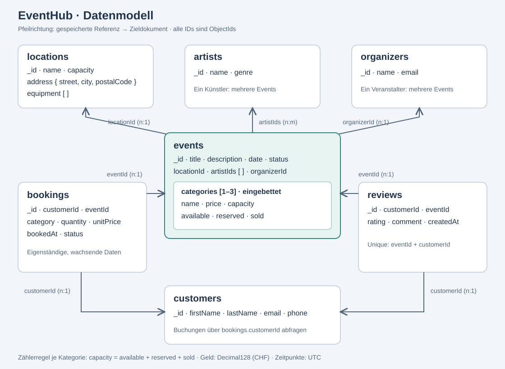
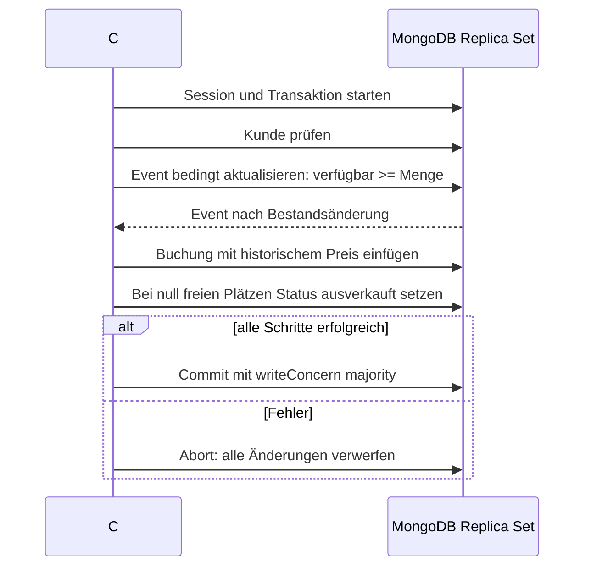

# Datenmodell

Die Pfeile der Grafik zeigen vom gespeicherten Referenzfeld zum referenzierten Dokument.
Ticketkategorien sind ein eingebettetes Array in `events`, keine eigene Collection.

## Collections

| Collection | Wesentliche Felder |
| --- | --- |
| `locations` | `_id`, `name`, `address {street, city, postalCode}`, `capacity`, `equipment[]` |
| `artists` | `_id`, `name`, `genre` |
| `organizers` | `_id`, `name`, `email` |
| `events` | `_id`, `title`, `description`, `date`, `locationId`, `organizerId`, `artistIds[]`, `status`, `categories[]` |
| `customers` | `_id`, `firstName`, `lastName`, `email`, `phone` |
| `bookings` | `_id`, `customerId`, `eventId`, `category`, `quantity`, `unitPrice`, `bookedAt`, `status` |
| `reviews` | `_id`, `customerId`, `eventId`, `rating`, `comment`, `createdAt` |

Alle IDs und Referenzen verwenden `ObjectId`, Zeitpunkte BSON `date` in UTC,
Geldbeträge `decimal` (Decimal128), Zähler und Ratings BSON `int`.
Die Konsole zeigt Eventtermine in der lokalen Zeitzone an.

Eine Kategorie enthält `name`, `price`, `capacity`, `available`, `reserved`, `sold`.
`quantity` erlaubt mehrere gleichartige Tickets in einer Buchung. Einzelne
Sitzplatznummern oder QR-Codes gehören nicht zum Umfang.

## Embedding oder Referencing?

| Beziehung | Entscheidung und Begründung |
| --- | --- |
| Event → Location (n:1) | `locationId` referenziert die wiederverwendbare Location. Eine Adresse muss nur an einem Ort gepflegt werden. |
| Event → Veranstalter (n:1) | `organizerId` referenziert `organizers`; derselbe Veranstalter betreut mehrere Events. |
| Event ↔ Künstler (n:m) | `artistIds[]` referenziert mehrere Künstler. Die Künstlerliste ist begrenzt (max. 50), Künstlerdaten werden wiederverwendet. Keine zweite redundante Eventliste im Künstler. |
| Event → Kategorien (1:1–3) | Kategorien eingebettet: klein, begrenzt und immer zum Event gehörend. Preis und freie Plätze werden zusammen mit dem Event gelesen. Kategorienamen sind innerhalb eines Events eindeutig. |
| Kunde → Buchungen (1:n) | Rückwärtsreferenz `bookings.customerId`. Kundenbuchungen werden per Index abgefragt. Kein unbegrenzt wachsendes Buchungs-ID-Array im Kunden. |
| Event → Buchungen (1:n) | Rückwärtsreferenz `bookings.eventId`. Buchungen bleiben eigenständige Dokumente und wachsen unabhängig vom Event. |
| Buchung → Kategorie | Kombination `eventId` und `category` identifiziert eine eingebettete Kategorie. `unitPrice` ist ein bewusst kopierter historischer Verkaufspreis. |
| Kunde/Event → Bewertungen (je 1:n) | Eigenständige `reviews` mit zwei Referenzen; unabhängig abfragbar, keine wachsenden Bewertungsarrays. Ein Unique-Index verhindert Mehrfachbewertungen. |
| Location → Adresse/Ausstattung | Kleine, zur Location gehörende Werte eingebettet. Keine eigenständige Identität oder separate Pflege nötig. |

Ein BSON-Dokument darf maximal 16 MiB gross sein. Zehntausende eingebettete Buchungen
würden das Event unbegrenzt vergrössern, das Limit gefährden und Schreibkonkurrenz auf
ein grosses Dokument konzentrieren. Auch ein unbeschränktes Array nur mit Buchungs-IDs
würde das Wachstumsproblem nicht grundsätzlich lösen. Separate Buchungen lassen sich
indexieren, paginieren und später sharden. Die Transaktion verbindet trotzdem den
Bestand im Event mit der neuen Buchung.

MongoDB speichert keine automatischen Fremdschlüssel. App-Prüfungen und
`09-verify.js` übernehmen die fachliche Referenzkontrolle. Schema-Validierung allein
kann nicht kontrollieren, ob eine ObjectId in einer anderen Collection existiert.

## Indexe

| Index | Zweck und Abwägung |
| --- | --- |
| `events: {locationId:1, date:1}` | Erst Location-Gleichheit, dann Datumsbereich. Compound-Index für Standort-/Terminabfragen. |
| `events: {title:'text', description:'text'}` | Wortsuche mit deutscher Sprachanalyse; kein beliebiges Substring-Matching. |
| `events: {date:1, _id:1}` | Stabile Sortierung der Seiten; `_id` als eindeutiger Tie-Breaker. |
| `bookings: {eventId:1, status:1}` | Gezielte Suche nach bezahlten/reservierten Buchungen eines Events. |
| `bookings: {customerId:1, bookedAt:-1}` | Kundenhistorie in zeitlich absteigender Reihenfolge. |
| `customers: {email:1}`, unique | Verhindert doppelte E-Mail-Adressen. Keine automatische Gross-/Kleinschreibungsnormalisierung. |
| `reviews: {eventId:1, customerId:1}`, unique | Genau eine Bewertung pro Kunde und Event. |

Indexe kosten Speicher und zusätzliche Arbeit beim Schreiben. Deshalb werden sie
an den konkreten Abfragen ausgerichtet. `08-explain.js` zeigt für drei Indexfälle
die Ausführungspläne und die Zahl untersuchter Dokumente. Bei kleinen Testmengen
ist eine Laufzeitdifferenz in Millisekunden wenig aussagekräftig.

## Transaktionsablauf

`WithTransactionAsync` wiederholt geeignete vorübergehende Fehler. Deshalb werden
im Callback keine externen Zahlungen oder Nachrichten ausgelöst. Die Buchungs-ID
wird vor dem Callback erzeugt und bleibt bei einem internen Retry gleich.

Quelle zum Dokumentlimit: [MongoDB Limits and Thresholds](https://www.mongodb.com/docs/manual/reference/limits/).
