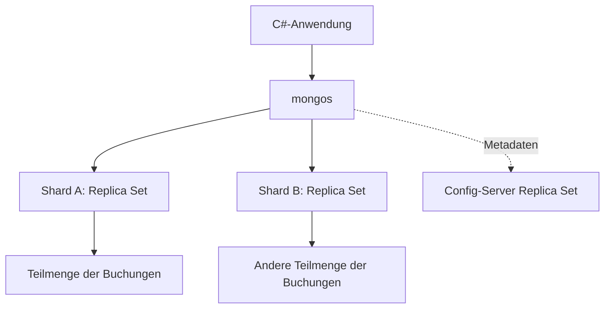

# AO2: Sharding-Konzept für Buchungen

Dieses Kapitel ist ein Konzept, kein produktiv eingerichteter Sharding-Cluster.
Das lokale Projekt verwendet ausschliesslich ein Replica Set.

## Ausgangspunkt

`bookings` wächst am stärksten. Replikation kopiert dieselben Daten und verbessert
die Ausfallsicherheit; sie verteilt den Schreibdurchsatz einer Collection nicht
automatisch auf unabhängige Primaries. Sharding würde Buchungsdokumente auf mehrere
Shards aufteilen. Jeder Shard sollte selbst ein Replica Set sein. Hinzu kommen
ein Config-Server-Replica-Set und `mongos` als Router.

## Vorschlag: gehashte Buchungs-ID

Ein möglicher Shard Key ist `{ _id: 'hashed' }`. Jede Buchung hat eine eigene ObjectId.
Das Hashing verteilt auch die Buchungen eines besonders grossen Events und
vermeidet, dass die zeitlich steigende ObjectId nur den letzten Wertebereich belastet.
Abfragen mit exakter Buchungs-ID lassen sich gezielt routen.

Der Preis: Abfragen nur nach `eventId` oder `customerId` müssen mehrere Shards fragen
(Scatter/Gather). Lokale Indexe `{eventId:1,status:1}` und
`{customerId:1,bookedAt:-1}` bleiben wichtig, verhindern aber das Anfragen mehrerer
Shards nicht. Ein Hash-Index selbst ist kein Unique-Index; der normale `_id`-Index
bleibt separat bestehen. Gleiche `_id`-Werte ergeben denselben Shard-Key-Wert und
werden zum selben Shard geroutet, wo der Unique-Index sie abweist. Bei einem Shard Key
ohne `_id` würde die `_id`-Eindeutigkeit dagegen nur pro Shard erzwungen. Diese Regeln
müssen vor einer tatsächlichen Migration getestet werden.

## Verworfene Alternativen und Grenzen

`{ eventId: 'hashed' }` macht Eventabfragen gut routbar, legt aber alle Buchungen
eines einzelnen Events auf denselben Shard-Key-Wert. Gerade ein grosses Festival
könnte wieder einen Hotspot bilden. `{ eventId: 1, _id: 1 }` erlaubt die Aufteilung
eines grossen Events in Bereiche und unterstützt Eventabfragen; die tatsächliche
Lastverteilung hängt dann stärker von Chunk-Aufteilung, Balancer und Zugriffsmuster ab.
Die Wahl müsste mit realen Lastdaten verglichen werden.

Die Transaktion zwischen `events` und `bookings` kann durch Sharding mehrere Shards
betreffen und teurer werden. Vor allem bleibt das Bestandsdokument eines beliebten
Events ein gemeinsamer Schreibpunkt. Nur `bookings` zu sharden beseitigt diesen
Engpass nicht. Eine spätere Zerlegung des Bestands nach Kategorien oder Kontingenten
wäre ein eigenes Modellierungsprojekt mit zusätzlichen Konsistenzfragen.

Für die 120 Testbuchungen wäre Sharding unnötiger Betriebsaufwand. Vor einer Migration
würden wir Lasttests, häufige Abfragen, Verteilung, Latenz der Transaktionen und
Backup-/Wiederherstellungsverfahren prüfen. Das Konzept erklärt daher eine mögliche
Skalierung, ohne einen im Projekt nicht erbrachten Leistungsnachweis zu behaupten.

Quellen: [Hashed Sharding](https://www.mongodb.com/docs/manual/core/hashed-sharding/),
[Unique Indexes in Sharded Clusters](https://www.mongodb.com/docs/manual/core/index-unique/).
